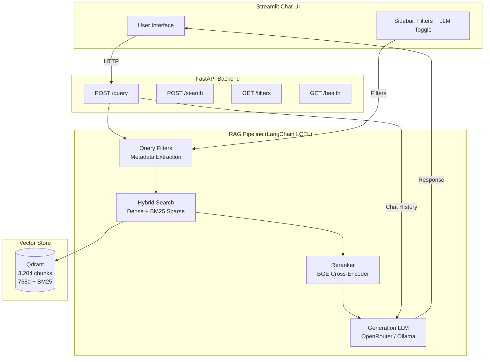

# FitAssist — Fitness Exercise RAG Assistant

[](https://python.org)
[](https://langchain.com)
[](https://qdrant.tech)
[](https://fastapi.tiangolo.com)
[](https://streamlit.io)
[](/)
[](/)

End-to-end RAG system for fitness exercise Q&A. Ask questions like *"What exercises target my chest?"*, *"How do I deadlift?"*, or *"Give me beginner leg exercises"* and get sourced, expert-level answers from a knowledge base of **3,204 exercises**.

Built with hybrid search (dense + BM25), cross-encoder reranking, metadata-guided pre-filtering, and a three-tier evaluation framework combining deterministic retrieval metrics with RAGAS Faithfulness and custom guardrail metrics.

---

## Architecture 



**Request flow:** User query → metadata filter extraction → hybrid dense + BM25 search → cross-encoder reranking (only when no filter applied) → context injection → LLM generation → sourced answer.

---

## Features

- **3,204 indexed exercises** from 3 datasets, unified and deduplicated (1,183 empty records dropped)
- **Hybrid search** — dense embeddings (BGE-base-en-v1.5, 768d) + BM25 sparse vectors via Qdrant `Prefetch`
- **Cross-encoder reranking** — BGE-reranker-base, applied selectively when no metadata filters narrow the search space
- **Metadata-guided pre-filtering** — automatic body_part, equipment, level extraction from informational queries, applied as Qdrant payload filters before search
- **LangChain LCEL pipeline** — fitness-expert system prompt with guardrails, source citations, and medical disclaimer
- **Dual LLM support** — OpenRouter (cloud) with runtime toggle; Ollama (local) fallback
- **Multi-turn conversation** — 5-turn sliding window memory
- **FastAPI backend** with typed Pydantic schemas, CORS, structured error handling
- **Streamlit frontend** with metadata filter sidebar and LLM provider toggle
- **Three-tier evaluation framework** — deterministic retrieval metrics + RAGAS Faithfulness + custom DiscreteMetrics (disclaimer, citation, off-topic refusal)
- **79 pytest tests** covering chunking, prompts, schemas, serialization, retrieval metrics, config, and API
- **Docker Compose** — one command for the full stack

---

## Quick Start

### Prerequisites

- Python 3.12+
- Docker (for Qdrant)
- [uv](https://docs.astral.sh/uv/getting-started/installation/) package manager
- OpenRouter API key ([free](https://openrouter.ai/keys)) or Ollama

### Setup

```bash
# Clone & install
git clone https://github.com/MohamedShakshak/Fitness-Assistant.git
cd Fitness-Assistant
uv sync

# Configure
cp .env.example .env
# Edit .env with your OpenRouter API key

# Start Qdrant
docker run -d -p 6333:6333 -p 6334:6334 -v qdrant_storage:/qdrant/storage qdrant/qdrant

# Index data (first run: ~3-5 min, downloads embedding model ~430MB)
uv run python scripts/index_data.py
```

### Run

```bash
# Terminal 1 — API
uv run python -m src.api.main

# Terminal 2 — Streamlit UI
uv run streamlit run src/app/streamlit_app.py
```

Open [http://localhost:8501](http://localhost:8501).

### Docker Compose (Full Stack)

```bash
docker compose up -d
```

---

## Evaluation

### Retrieval Metrics (Deterministic — No LLM Required)

```bash
# With reranker (recommended)
uv run python scripts/eval_retrieval.py

# Without reranker (faster, for ablation)
uv run python scripts/eval_retrieval.py --no-rerank
```

25 manually curated Q&A pairs across 5 categories. Name matching uses normalization (lowercase, strip trailing punctuation, collapse whitespace) to reduce false negatives.

| Category | Recall@5 | MRR | Hit Rate | n |
|----------|----------|-----|----------|---|
| how_to | **1.0000** | 0.7067 | 1.0000 | 5 |
| comparison | **0.7000** | 0.7000 | 0.8000 | 5 |
| muscle_equipment | 0.4000 | 0.4667 | 0.8000 | 5 |
| level_based | 0.3571 | 0.5000 | 0.6000 | 5 |
| muscle_targeting | 0.1667 | 0.2667 | 0.6000 | 5 |
| **Overall** | **0.5248** | **0.5280** | **0.7600** | 25 |

**Key improvements over baseline:**

| Metric | Baseline | Current | Change |
|--------|----------|---------|--------|
| Recall@5 | 0.3467 | **0.5248** | **+51%** |
| MRR | 0.3200 | **0.5280** | **+65%** |
| Hit Rate | 0.5200 | **0.7600** | **+46%** |

Improvements from: metadata-guided pre-filtering, expanded ground truth for broad queries, smart cross-encoder reranking (applied only when no filters narrow the search space).

### Full Evaluation (RAGAS + Guardrails)

```bash
uv run python scripts/run_evaluation.py
```

Adds RAGAS Faithfulness (judge LLM checks answer grounding against retrieved context) and custom DiscreteMetrics for domain-specific guardrails:

| Metric | What it measures | Judge LLM |
|--------|-----------------|-----------|
| Faithfulness | % of answer claims supported by context | RAGAS judge |
| Citation rate | % of responses with `[Source: ...]` | RAGAS `DiscreteMetric` |
| Disclaimer rate | % of responses with medical disclaimer | RAGAS `DiscreteMetric` |
| Refusal rate | % of off-topic questions correctly refused | RAGAS `DiscreteMetric` |

### Test Suite

```bash
uv run pytest tests/ -v
```

79 tests — chunking, prompts, API schemas, Qdrant serialization, retrieval metrics, configuration, API endpoints.

---

## API Endpoints

| Method | Endpoint | Description |
|--------|----------|-------------|
| `POST` | `/query` | Full RAG query → `{answer, sources, context_used}` |
| `POST` | `/search` | Retrieval-only (no LLM) → `{results}` |
| `GET` | `/filters` | Available filter values for Streamlit sidebar |
| `GET` | `/health` | Health check |

### Example

```bash
curl -X POST http://localhost:8000/query \
  -H "Content-Type: application/json" \
  -d '{"query": "What are some beginner chest exercises with dumbbells?"}'
```

Response:

```json
{
  "answer": "Dumbbell Bench Press and Dumbbell Flyes are beginner-friendly chest exercises [Source: wrkout]. This information is for educational purposes only...",
  "sources": [
    {"name": "Dumbbell Bench Press", "equipment": "dumbbell", "level": "beginner", "source_db": "wrkout"},
    {"name": "Dumbbell Flyes", "equipment": "dumbbell", "level": "beginner", "source_db": "wrkout"}
  ],
  "context_used": true
}
```

---

## Data Sources

| Source | Exercises | License | Content |
|--------|-----------|---------|---------|
| [wrkout/exercises.json](https://github.com/wrkout/exercises.json) | 873 | Unlicense | Step-by-step instructions, equipment, mechanics |
| [Kaggle: Gym Exercise Dataset](https://www.kaggle.com/datasets/niharika41298/gym-exercise-data) | 2,918 | CC0-1.0 | Descriptions, body part, equipment, level |
| [Kaggle: Fitness Exercises Dataset](https://www.kaggle.com/datasets/omarxadel/fitness-exercises-dataset) | 1,324 | MIT | Targeted muscles, instructions, equipment |
| **Unified** | **4,387** (3,204 indexed) | — | Unified schema, deduplicated by name |

---

## Configuration

All settings via `.env` (see `.env.example`):

| Variable | Default | Description |
|----------|---------|-------------|
| `QDRANT_URL` | `http://localhost:6333` | Qdrant connection |
| `OPENROUTER_API_KEY` | — | OpenRouter key |
| `OPENROUTER_MODEL` | `nvidia/nemotron-3-super-120b-a12b:free` | Generation model |
| `LLM_PROVIDER` | `openrouter` | `openrouter` or `ollama` |
| `TOP_K` | `5` | Retrieved results |
| `EVAL_PROVIDER` | `openrouter` | Eval judge provider |
| `EVAL_MODEL` | `gemini/gemini-1.5-flash` | RAGAS judge model |
| `GEMINI_API_KEY` | — | Google AI Studio key for eval |
| `LOG_LEVEL` | `INFO` | Logging verbosity |

Full list of 30+ settings in `.env.example`.

---

## Tech Stack

| Component | Technology |
|-----------|-----------|
| Language | Python 3.12 |
| Package manager | uv |
| RAG framework | LangChain (LCEL) |
| Embedding model | BGE-base-en-v1.5 (768d, sentence-transformers) |
| Reranker | BGE-reranker-base (cross-encoder) |
| Sparse search | BM25 via fastembed (Qdrant/bm25) |
| Vector store | Qdrant (Docker, hybrid dense + sparse) |
| Cloud LLM | OpenRouter (OpenAI-compatible API) |
| Local LLM | Ollama (Qwen3.5:9B) |
| Backend | FastAPI (Pydantic v2, CORS, logging) |
| Frontend | Streamlit (sidebar filters, chat UI) |
| Evaluation | RAGAS 0.4.3 (Faithfulness + DiscreteMetric) |
| Testing | pytest (79 tests, mocked APIs) |
| Infrastructure | Docker Compose (3 services) |

---

## Project Structure

```
Fitness-Assistant/
├── data/
│   ├── raw/                    # Source datasets
│   ├── processed/              # 4,387 unified exercises
│   ├── chunks/                 # 3,204 LangChain Documents
│   └── eval/                   # 25 Q&A pairs + 5 off-topic
├── src/
│   ├── chunking/chunker.py     # 1-exercise-per-chunk, labeled-section format
│   ├── embedding/
│   │   ├── embedder.py         # BGE-base-en-v1.5 (768d)
│   │   └── reranker.py         # BGE-reranker-base
│   ├── vectorstore/qdrant_store.py  # Hybrid search, serialization, filters
│   ├── retrieval/
│   │   ├── retriever.py        # Search + smart reranking orchestrator
│   │   ├── query_filters.py    # Metadata extraction from natural language
│   │   └── query_expansion.py  # LLM-based multi-query generation
│   ├── generation/
│   │   ├── llm_client.py       # ChatOpenAI / ChatOllama factory
│   │   └── prompts.py          # Fitness-expert system prompt + templates
│   ├── pipeline.py             # End-to-end RAG LCEL chain
│   ├── evaluation/
│   │   ├── evaluator.py        # Scoring orchestrator
│   │   ├── metrics.py          # Custom DiscreteMetrics
│   │   ├── ragas_setup.py      # Judge LLM factory (OpenRouter / Gemini)
│   │   └── report.py           # CSV/JSON/markdown output
│   ├── api/
│   │   ├── main.py             # FastAPI app (4 endpoints)
│   │   └── schemas.py          # Pydantic request/response models
│   └── app/streamlit_app.py    # Chat UI
├── scripts/
│   ├── index_data.py           # Load → chunk → embed → upsert
│   ├── eval_retrieval.py       # Deterministic retrieval metrics
│   └── run_evaluation.py       # Full multi-metric eval
├── tests/                      # 79 pytest tests
├── evals/experiments/          # Evaluation results
├── docker-compose.yml
├── Dockerfile
└── pyproject.toml
```

---

## License

Educational/personal use. Data sourced from publicly available datasets under CC0, MIT, and Unlicense licenses. See individual source pages for terms.
